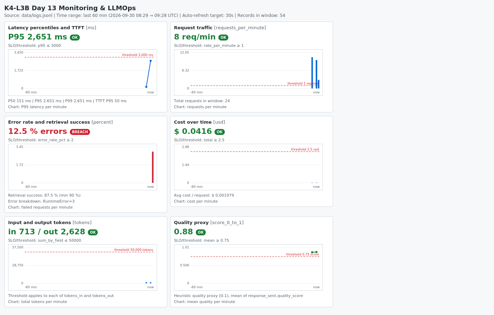

# Báo cáo cá nhân — K4-L3B Day 13 Monitoring & LLMOps

> Mỗi học viên hoàn thiện một file duy nhất này. Khi dẫn evidence, dùng đường dẫn tương đối, ví dụ `evidence/07-trace-waterfall.png`.
>
> **Ghi chú trạng thái:** các mục đánh dấu **[CẦN BỔ SUNG]** phụ thuộc vào project Langfuse cá nhân, GitHub và Lab Coach nên chưa thể điền từ môi trường không có tài khoản Langfuse. Mọi số liệu còn lại bên dưới lấy từ lần chạy thật, xem `submission/evidence/`.

## 1. Thông tin học viên

- **Họ và tên:** Nguyen Manh Tien
- **MSSV:** 2A202602506
- **Lớp:** K4-L3B
- **Repository URL:** **[CẦN BỔ SUNG]** (`K4-L3-DAY13-NguyenManhTien-2A202602506-Monitoring-LLMOps`)
- **Commit SHA cuối:** **[CẦN BỔ SUNG]** (chạy `git log -1 --oneline` sau khi commit)
- **Challenge ID:** `day13-k4-l3b-monitoring-llmops-v1` (theo `config/challenge.json`; xem mục 7 về trạng thái chạy)
- **Tên project Langfuse cá nhân:** `day13-k4-l3b-2A202602506`

## 2. Evidence index

| Evidence | Đường dẫn | Trạng thái |
|---|---|---|
| Pytest baseline | `evidence/00-baseline-pytest.txt` | Có (22 passed) |
| Log validator baseline | `evidence/00-baseline-log-validator.txt` | Có (30/100) |
| Dashboard validator baseline | `evidence/00-baseline-dashboard-validator.txt` | Có |
| Pytest cuối | `evidence/01-pytest.txt` | Có (35 passed) |
| Log validator | `evidence/02-log-validator.txt` | Có (100/100) |
| Dashboard validator | `evidence/03-dashboard-validator.txt` | Có (6/6) |
| Structured log | `evidence/04-structured-log.txt` | Có |
| PII redaction | `evidence/05-pii-redaction.txt` | Có |
| Trace list | `evidence/06-trace-list.png` | **[CẦN BỔ SUNG]** chụp từ Langfuse |
| Trace waterfall | `evidence/07-trace-waterfall.png` | **[CẦN BỔ SUNG]** |
| Trace metadata | `evidence/08-trace-metadata.png` | **[CẦN BỔ SUNG]** |
| Prompt versions | `evidence/09-prompt-versions.png` | **[CẦN BỔ SUNG]** |
| Prompt rollback | `evidence/10-prompt-rollback.png` | **[CẦN BỔ SUNG]** |
| Dashboard runtime | `evidence/11-dashboard-overview.png` (HTML: `evidence/11-dashboard-overview.html`) | Có |
| Incident metric | `evidence/12-incident-metric.png` | Có (chạy practice `rag_slow`) |
| Incident log | `evidence/13-incident-log.txt` | Có (chạy practice `rag_slow`) |
| Incident trace | `evidence/14-incident-trace.png` | **[CẦN BỔ SUNG]** |

## 3. Kết quả kỹ thuật

| Nội dung | Baseline | Kết quả cuối | Nhận xét |
|---|---|---|---|
| `validate_logs.py` | 30/100: 20 record thiếu field bắt buộc, 20 thiếu enrichment, 0 correlation ID | 100/100: 0 thiếu field, 0 thiếu enrichment, 12 correlation ID duy nhất | Middleware + bind context + scrubber đã đăng ký |
| `validate_dashboard.py` | 6/6 | 6/6 | Contract `config/dashboard.yaml` giữ nguyên |
| `pytest` | 22 passed | 35 passed | Thêm test PII, correlation ID/logging, child observation |
| Số traces hợp lệ | 0 | **[CẦN BỔ SUNG]** (cần ≥ 10 trong Langfuse cá nhân) | Đã kiểm tra cây span cục bộ bằng OTLP sink, xem mục 5 |
| Số PII leak | 0 | 0 | Baseline = 0 vì `summarize_text` đã scrub message preview; scrubber mới bảo vệ toàn bộ field |
| Latency P95 / TTFT P95 | 151 ms / 50 ms (bình thường) | 2651 ms / 50 ms khi bật practice `rag_slow` | Chỉ latency tăng, TTFT giữ nguyên |
| Retrieval success rate | 100% | 100% bình thường; 87.5% trong cửa sổ có 3 request `tool_fail` (practice) | Dưới guardrail 90% khi có lỗi retrieval |

## 4. Logging và PII

- **Cách tạo/nhận và truyền correlation ID:** `CorrelationIdMiddleware` (`app/middleware.py`) gọi `clear_contextvars()` đầu mỗi request, nhận `x-request-id` nếu hợp lệ (`^[A-Za-z0-9][A-Za-z0-9._-]{0,63}$`, tránh log injection) hoặc sinh `req-<8-hex>`, rồi `bind_contextvars(correlation_id=...)`, lưu vào `request.state`, và trả lại qua header `x-request-id` cùng `x-response-time-ms`. ID này được truyền vào `LabAgent.run` để đưa vào metadata của trace.
- **Các metadata được ghi vào structured log:** `chat()` bind `user_id_hash` (SHA-256 cắt 12 ký tự), `session_id`, `feature`, `model`, `env` trước log `request_received`, nên mọi log sau (`response_sent`, `request_failed`) đều có; ngoài ra có `ts`, `level`, `service`, `event`, `latency_ms`, `ttft_ms`, `tokens_in/out`, `cost_usd`, `quality_score`, `tool_name`, `tool_success`, `error_type`.
- **Cách bảo đảm PII được scrub trước khi ghi:** processor `scrub_event` được đăng ký trong `configure_logging()` **trước** `JsonlFileProcessor` và `JSONRenderer`, nên dữ liệu đã sạch khi serialize/ghi file. Nó quét đệ quy mọi field văn bản (kể cả `payload` lồng nhau và list), trừ các field do hệ thống sinh ra (`ts`, `correlation_id`, `user_id_hash`...) để tránh che nhầm. `app/pii.py` có pattern cho email, thẻ thanh toán, CCCD, số điện thoại VN, hộ chiếu và địa chỉ (số nhà + đường/phố/ngõ). Thứ tự pattern có chủ đích: thẻ và CCCD chạy trước điện thoại để số thẻ không bị cắt thành "số điện thoại".
- **Cách kiểm chứng kết quả:** `tests/test_pii.py` và `tests/test_correlation_and_logging.py` (header, format ID, không rò context giữa request, enrichment, scrub lồng nhau); `validate_logs.py` đạt 100/100; gửi thử request chứa CCCD/hộ chiếu/SĐT/email giả và kiểm tra log (`evidence/05-pii-redaction.txt`).

## 5. Tracing và prompt versioning

- **Cách xác nhận traces do chính tôi tạo trong project cá nhân:** **[CẦN BỔ SUNG]** — tạo project `day13-k4-l3b-2A202602506`, điền key của chính bạn vào `.env`, chạy `python scripts/load_test.py` ≥ 1 lần (10 request/lần), chụp danh sách trace có tên project.
- **Cấu trúc root/retrieval/generation observations:** root `lab-agent-run` (agent) → child `retrieval` (`as_type="retriever"`, input là preview đã scrub, output `doc_count`, lỗi thì `level=ERROR`) và child `llm-generate` (`as_type="generation"`, có `model`, input/output preview đã scrub, `usage_details` input/output, `cost_details` input/output/total, `completion_start_time` theo TTFT). Tôi đã kiểm tra cấu trúc này cục bộ bằng cách chụp gói OTLP mà SDK gửi đi: hai span con cùng parent là `lab-agent-run`, chứa đủ model, token và cost, và email trong câu hỏi đã thành `[REDACTED_EMAIL]`. Đây chỉ là kiểm tra cục bộ, **không thay thế** ảnh waterfall từ Langfuse.
- **Cách nối trace với log:** `correlation_id` nằm trong `metadata` của trace (qua `propagate_attributes`) và trong mọi dòng log; từ log lấy `correlation_id` rồi lọc trace theo metadata này.
- **Prompt name:** `day13-chat` (biến `{{feature}}`, `{{docs}}`, `{{message}}`).
- **Version/label baseline:** **[CẦN BỔ SUNG]** (v1: `baseline` + `production`).
- **Version/label candidate:** **[CẦN BỔ SUNG]** (v2: `candidate`).
- **Trace ID của mỗi version:** **[CẦN BỔ SUNG]**
- **Cách promote và rollback `production`:** **[CẦN BỔ SUNG]** — làm theo `docs/PROMPT_VERSIONING.md`: chuyển label `production` sang v2, chạy 1 request, rồi chuyển lại v1 và chụp ảnh. Không sửa code khi đổi version. Metadata `prompt_name/label/version` đến từ Langfuse; nếu thấy `local-v1` thì đang dùng fallback.

## 6. Dashboard, SLO và alerts

- **Dashboard và sáu panel:** `scripts/build_dashboard.py` đọc `data/logs.jsonl` và `config/dashboard.yaml`, sinh trang HTML/PNG gồm đúng 6 panel: latency (P50/P95/P99 + TTFT P95), traffic, errors (error rate, breakdown theo `error_type`, retrieval success), cost, tokens, quality. Mỗi panel có đơn vị, time range 60 phút, đường threshold và huy hiệu OK/BREACH. Ảnh: `evidence/11-dashboard-overview.png`.
- **SLO và lý do chọn:** `fast_successful_requests`: 99.5% request có `response_sent` với `latency_ms <= 2000` trong 28 ngày. Baseline P99 chỉ ~151 ms; ngưỡng dashboard 3000 ms sẽ **không** bắt được sự cố `rag_slow` (latency ~2651 ms), nên SLO dùng 2000 ms (trùng `latency_threshold_ms` của challenge). Dashboard vẫn giữ 3000 ms đúng contract.
- **Cách tính error budget:** SLO 99.5% trong 28 ngày nghĩa là error budget 0.5%. Nếu workload có 10,000 request thì tối đa 50 request được phép lỗi hoặc chậm hơn 2000 ms (~1.8 request/ngày). Burn rate = tỉ lệ request xấu / 0.5%.
- **Ba alert và runbook tương ứng** (`config/alert_rules.yaml`, `docs/alerts.md`, kênh Slack `#k4-l3b-alerts`, owner `student-2A202602506`):
  1. `HighLatencyP95` — warning, `p95(latency_ms) > 2000` trong 5m → `docs/alerts.md#alert-1`.
  2. `HighErrorRateOrRetrievalFailure` — critical, error rate > 2% hoặc retrieval success < 90% trong 5m → `#alert-2`.
  3. `HighCostPerRequest` — warning, `avg(cost_usd) > 0.004` USD/request trong 10m → `#alert-3`. Ba alert tương ứng với ba practice scenario `rag_slow`, `tool_fail`, `cost_spike`.

## 7. Điều tra challenge

> **Trạng thái:** phần dưới đây được điều tra bằng **practice scenario `rag_slow`** (`inject_incident.py --scenario rag_slow`), vì challenge chính thức chỉ được chạy khi Lab Coach thông báo. Cần chạy lại bằng `python scripts/inject_incident.py` và `python scripts/load_test.py --challenge --concurrency 5` rồi thay số liệu, log line và trace ID bằng kết quả chính thức.

- **Challenge ID:** `day13-k4-l3b-monitoring-llmops-v1` (incident cấu hình: `rag_slow`)
- **Khoảng thời gian điều tra (practice, UTC):** 2026-09-30 09:27:28 → 09:27:55
- **Triệu chứng từ metrics:** latency P95 tăng từ 151 ms lên 2651 ms (P99 2651 ms), vượt SLO 2000 ms; TTFT P95 không đổi (50 ms); error rate 0%, retrieval success 100%, cost/token không đổi. Vì TTFT không đổi nên nghi ngờ bước trước khi LLM bắt đầu sinh — tức retrieval. Ảnh: `evidence/12-incident-metric.png`.
- **Log line và correlation ID liên quan:** `python scripts/find_slow_requests.py --threshold-ms 2000` cho 10 request `response_sent` với `latency_ms=2651`, ví dụ `correlation_id=req-acbca146` (feature `qa`) lúc 09:27:31Z. Xem `evidence/13-incident-log.txt`.
- **Trace ID và span gây ảnh hưởng:** **[CẦN BỔ SUNG]** — mở trace có metadata `correlation_id=req-acbca146` (hoặc ID của lần chạy chính thức) trên Langfuse. Dự kiến span `retrieval` chiếm ~2.5 s trong khi `llm-generate` chỉ ~150 ms; phải xác nhận bằng trace thật rồi mới kết luận.
- **Root cause:** giả thuyết từ metric + log: bước retrieval chậm thêm ~2.5 s (trong code `mock_rag.retrieve` có `time.sleep(2.5)` khi `rag_slow` bật). **Chỉ được coi là root cause khi trace thật cho thấy span `retrieval` chiếm phần lớn thời gian.**
- **Fix action:** tắt/khôi phục dependency retrieval (`inject_incident.py --scenario rag_slow --disable` khi luyện tập; trên hệ thống thật là khôi phục vector store), sau đó chạy lại load test và xác nhận P95 về ~150 ms.
- **Preventive measure:** alert `HighLatencyP95` (2000 ms/5m) kèm runbook; đặt timeout và fallback cho retrieval; hạ ngưỡng SLO xuống 2000 ms để sự cố này không lọt dưới ngưỡng dashboard 3000 ms; thêm span retrieval để khoanh vùng nhanh.

## 8. Giải thích và tự đánh giá

> Mục này cần được bạn đọc lại, sửa bằng lời của mình và tự hiểu để bảo vệ khi Q&A; bên dưới là bản nháp dựa trên những gì thực sự xảy ra khi làm.

- **Một quyết định kỹ thuật quan trọng và lý do:** tạo child observation qua `start_observation()` trong `app/tracing.py` (gọi trực tiếp `get_client().start_as_current_observation`) thay vì dùng client được inject cho việc lấy prompt. Nhờ vậy test `test_agent_prompt_trace.py` (client giả chỉ có `get_prompt`/`update_current_span`) vẫn đúng và metadata cuối của root span không bị ghi đè.
- **Một lỗi/blocker đã gặp:** (1) `user_id_hash` gồm 12 ký tự hex có thể toàn chữ số và bị nhận nhầm là CCCD, nên `scrub_event` bỏ qua các field hệ thống. (2) Nếu chạy phone regex trước, số thẻ có nhóm `0000` bị cắt nhầm thành số điện thoại, nên đặt thẻ/CCCD trước điện thoại. (3) Trong practice `rag_slow`, `retrieve()` dùng `time.sleep` đồng bộ trong endpoint `async`, chặn event loop: `latency_ms` trong log là ~2.65 s nhưng client phía load test thấy tới ~13 s do các request xếp hàng.
- **Cách tìm nguyên nhân và xử lý:** lấy baseline trước khi sửa, đo lại trên log mới (xóa `data/logs.jsonl` cũ), viết test cho từng lỗi, và kiểm tra cấu trúc span bằng gói OTLP thật.
- **Cách hiểu luồng Metrics → Logs → Traces:** metrics cho biết có vấn đề gì và từ lúc nào (P95 tăng, TTFT không đổi); logs chọn ra request cụ thể bằng `correlation_id`; trace của request đó chỉ ra bước nào chậm hoặc lỗi. Không đoán root cause trước khi có đủ ba lớp bằng chứng.
- **Vai trò của prompt version, token/cost, SLO hoặc rollback trong vận hành LLM:** prompt ảnh hưởng trực tiếp đến chất lượng, latency và chi phí, nên cần version/label để biết request nào dùng prompt nào và rollback nhanh khi có regression. Token/cost cho thấy sự cố kiểu `cost_spike` mà latency không phản ánh. SLO + error budget cho biết mức lỗi được phép và khi nào phải dừng release.
- **Điều quan trọng nhất đã học:** chọn ngưỡng SLO theo baseline thật; ngưỡng quá rộng (3000 ms) sẽ bỏ sót sự cố (2651 ms).
- **Hạn chế hoặc phần chưa hoàn thành, nếu có:** chưa có trace/prompt evidence từ Langfuse cá nhân, chưa chạy challenge chính thức, dashboard là báo cáo tĩnh sinh từ log (chạy lại `build_dashboard.py` để làm mới) chứ không phải dashboard tự refresh, và `find_slow_requests.py`/`build_dashboard.py` là công cụ bổ sung của repo.

## 9. Checklist trước khi nộp

- [ ] Kết quả và evidence thuộc commit SHA cuối.
- [ ] Tất cả ảnh/output mở được bằng đường dẫn tương đối.
- [ ] Incident evidence nối đúng metric → log → trace.
- [ ] Trace/prompt evidence thuộc project Langfuse cá nhân và ảnh không lộ key/secret.
- [ ] Repository chạy lại được theo README.
- [ ] Không có secret, API key, PII thô hoặc evidence của người khác/lớp khác.
- [ ] URL repo và commit SHA cuối đã được nộp trên LMS/Codelabs.
